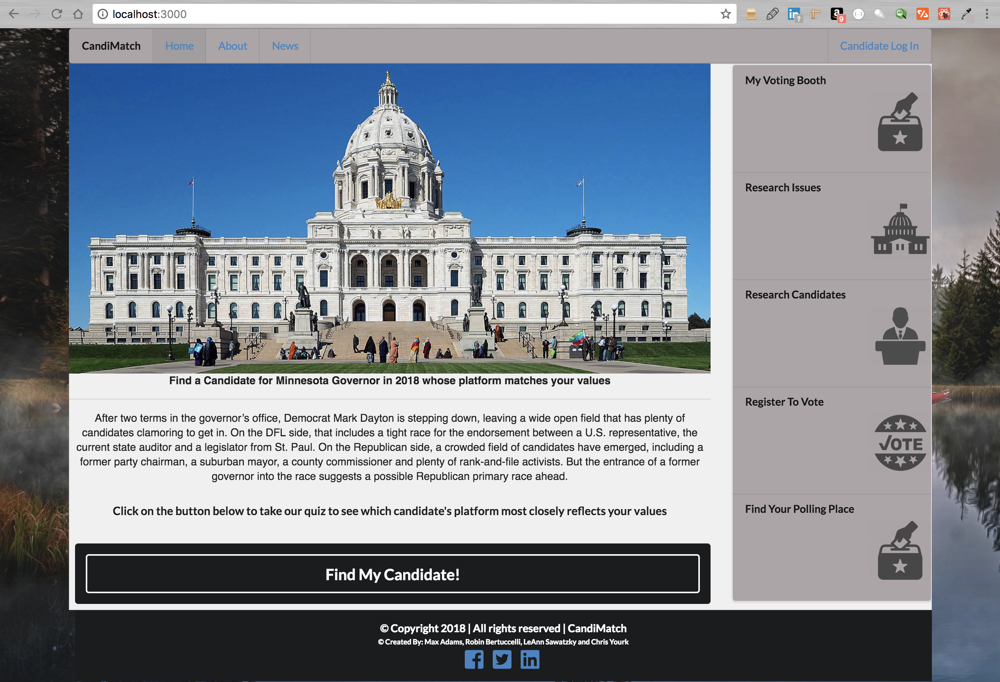
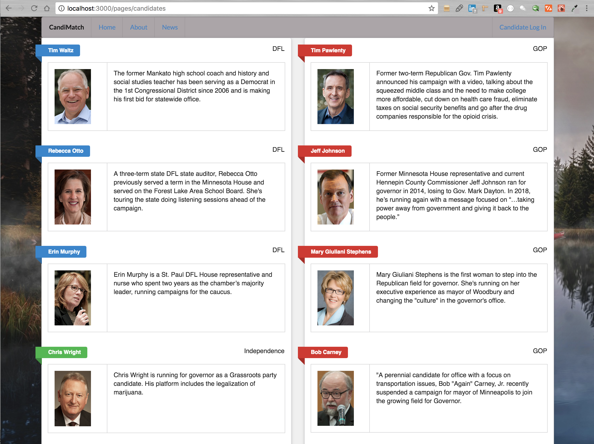

# CandiMatch
<p>CandiMatch is a full stack, MERN application that connects voters with candidates running for Governor of Minnesota. With this application, you can do the following:</p>
<ul>
	<li>Take a political values questionaire to see which candidate's platform most closely matches you political position.</li>
	<li>Research Candidates</li>
	<li>Research Issues</li>
	<li>Register to Vote</li>
	<li>Find you local polling place</li>

## Table of contents
  * [Live](#live)
  * [Screenshots](#screenshots)
  * [About this project](#about-this-project)
  * [Contributors](#contributors)
  * [Getting started](#getting-started)
  * [Structure of the project](#structure-of-project)
  * [Technologies used to create app](#technologies-used)
  	* [Backend technologies](#Backend)
  	* [Frontend technologies](#Frontend)
    * [About the Petfinder API](#petfinder)
  * [Design improvements](#design-improvements)
  * [Issues](#Issues)

## <a name="live"></a>Live
https://pet-match-app.herokuapp.com/

## <a name="screenshots"></a> Screenshots

### Home page


### Candidate Research



### CandiMatch Survey Page


## <a name="about-this-project"></a> About this project

  * [How the app works](#how-app-works)
  * [How the app is built](#how-the-app-is-built)
  * [MVC design pattern](#about-mvc)
 
### <a name="how-app-works"></a> How the app works
This project is a full stack application that helps the user match their poitical values with a candidates platform. This application focuses on the 2018 Minnesota Governors Race. 

When you first start using the app, you will be taken to the home screen. When you get to the home screen of the app, you are presented with several options you may take the quiz which attempts to match you with a candidate that most closely matches your political vales based on how the user answers the questionaire. After you take the quiz, you will get your results back, with three candidates that whose platform's most closely matfh your values.  

If you don't want to take an assessment, or would like to do a bit more research first. You can skip the quiz and choose a link on the right vertical menu. You can choose to Research Issues, Research Candidates, Register To Vote, and Find your Polling Place.

### <a name="how-the-app-is-built"></a> How the app is built
This project uses React, Node.js, Express, React Router, MongoDB, and Semantic UI. Node and MySQL are used to query and route data in the application. Express is the backend web framework used for this application. Semantic UI React is a CSS framework that is used to design and build the front end part of the site. 

### <a name="about-mvc"></a> MVC design pattern
This project also follows the MVC (Model-View-Controller) design pattern. The MVC design pattern assigns objects in the application one of three roles (model, view, or controller) and defines the way the different parts of the application communicate with one another.

  * <b>View object:</b>
  A view object is an object in the application that is visible (in the user interface) to the end user of the application. The view displays data from the application's model and learns about any changes to the model data via the controller. For example, in this application, the user clicks the <b>Like</b> button next to the name of the pet that they want to add to their favorite pets list. The view communicates the pet information associated with the <b>Like</b> button via the controller to the model.

  * <b>Controller object:</b>
  A controller object controls the flow of data between the view and the model (that is, the controller is an intermediary between the two). The controller interprets any user changes made in the view and communicates the changed data to the model. Also, if the model were to change, the controller is what communicates the updated data to the view so that the user can see the updated data in the user interface.

  * <b>Model object:</b>
  A model object manages the data. When data is created or changed by the user in the view (for example, a user takes the pet compatibility assessment and saves the results), that change is communicated via the controller to the model. Also, when data is created or changed in the model, the model communicates that change via the controller to the view, and the view displays the updated data to the user.

For more information about the MVC design pattern, check out the following resources:
  * https://en.wikipedia.org/wiki/Model%E2%80%93view%E2%80%93controller
  * https://docs.microsoft.com/en-us/aspnet/core/mvc/overview

## <a name="contributors"></a> Contributors
* Back End Developer: Max Adams
* Back End Developer: Chris Young 
* Front End Developer: Robin Bertuccelli
* Front End Developer/Project Manager: LeAnn Sawatzky

## <a name="getting-started"></a> Getting started
The following section will take you through the steps of setting up this application and getting it running locally on your computer.

If you don't want to set up this project locally and just want to see the deployed application, go to  https://pet-match-app.herokuapp.com/

To set up this application locally on your computer, perform the following steps:
1. [Clone the repository](#clone-repository)
2. [Install Node.js](#install-node)
3. [Install the dependencies](#dependencies)
4. [Install Robo 3T](#install-mysql)
5. [Set up a development database](#database-setup)
7. [Verify database connection information](#db-connect)
8. [Start the server](#start-server)

### <a name="clone-repository"></a> 1. Clone the repository
The first step is to clone the project repository to a local directory on your computer. To clone the repository, run the following commands:
<pre>
  git clone https://github.com/robinb242/candiMatch.git
  cd candiMatch
</pre>

#### <a name="structure-of-project"></a> Structure of the project
<p>After you clone the repository, navigate to the project root directory (candiMatch). The project directory structure is set up as follows:</p>
<ul>
  <li> 
    <p><b>server.js</b>: This file does the following:</p>
		<ul>
	    	<li>Defines and requires the dependencies, including express, body-parser, and express-handlebars.</li>
	    	 <li>Sets up the Express server.</li>
	    	 <li>Sets up the Express server to handle data parsing using body-parser.</li>
	    	 <li>Points the server to the API routes, which gives the server a map of how to respond when users visit or request data from various URLs.</li>
        	<li>Defines the port the server is listening on.</li>
	    	 <li>Starts the server.</li>
         	<li>Allows the app to serve static content from the public directory.</li>
    	</ul>
  <li>
    <p><b>public</b>: Contains the static, front end content (images, Javascript, and CSS). </p>
    <ul>
      <li><b>assets/css/style.css</b>: External CSS stylesheet.</li>
      <li><b>assets/img</b>: Contains the background image used in the app.</li>
      <li><b>assets/src/modals</b>: Contains the front end Javascript that opens the modals in the application.</li
	  <li><b>assets/src/petDelete</b>: Contains the front end Javascript used to delete a liked pet from the <b>My saved pets</b> page as well as delete the compatibility assessment results.</li>
	  <li><b>assets/src/petSearch</b>: Contains the front end Javascript that allows a user to search for a pet. When a user fills outs the pet search form, a query is made to the Petfinder API based on the user input from the search form. The matching pets are returned from the API and displayed to the user in the application user interface.</li>
	  <li><b>assets/src/petMatch</b>: Contains the front end Javascript used to run through the list of assessment questions and come up with a potential pet match for a user.</li
    </ul>
  </li>
   
  <li>
    <p><b>db/schema.sql</b>: Contains code that you can run to create and set up a MySQL database locally on you computer.</li>
  </li>
  <li>
    <p><b>config</b>: Contains the config.json file, whic includes the code to connect Node to MongoDB.
  </li>
  <li>
    <p><b>controllers</b>: Contains two files.<p>
		<ul>
			<li><b>petMatchController.js</b>, which contains different routes for getting and posting user assessment results. These routes are used to pass information to and from the view and model objects.</li>
			<li><b>savedPetsController.js</b>, which contains different routes for posting liked pet information to the database, getting pet data from the database, and deleting liked pet information from the database.</li>
		</ul>
  
  <li><b>package.json</b>: Lists the project dependencies (third party npm packages) and their version numbers.</li>
  <li><b>.gitignore</b>: Anything listed inside this file will not be tracked by GitHub when code is committed.</li>
  <li><b>package-lock.json</b>: Dependency tree for the project. Lists all the dependencies and their versions. One for the server side dependencies and another for the client side dependencies</li>
</ul>


## Starting the app locally

Start by installing front and backend dependencies. While in this directory, run the following commands:

Start MongoDB server: Open a new terminal window and type the following command.

```
mongod

```
Go back to the terminal window open to the candiMatch directory and run.
```
yarn install
cd client
yarn install
cd ../
```
After both installations complete, run the following command in your terminal:

```
yarn start
```
That's it, your app should be running on <http://localhost:3000>. The Express server should intercept any AJAX requests from the client.
</pre>
<p>This will concurrently run "nodemon server.js" and "npm run client" </p>
<p>To verify that the server has started and the application is working locally on your computer, open Chrome and go to <a href="http://localhost:3000">http://localhost:3000</a>.</p>

## <a name="technologies-used"></a> Technologies used to build app
* [Backend technologies](#Backend)
* [Frontend technologies](#Frontend)

### <a name ="Backend"></a> Backend technologies
* Node.js (https://nodejs.org/en/)
* MongoDB (https://www.mongodb.com/)
* Express (http://expressjs.com/)
* Mongoose ODM (http://mongoosejs.com/)
* Javascript
* Passport.js Authentication for Node.js(http://www.passportjs.org/)

### <a name="Frontend"></a> Frontend technologies
* HTML
* CSS
* Semantic UI React (https://semantic-ui.com/)
* Javascript
* React (https://reactjs.org/)
* JSX notation (https://reactjs.org/docs/introducing-jsx.html)
* ES6 ()

### <a name="New Technologies"></a> New Technologies
* Semantic-UI-React - New CSS library
* ESLink - ES6 and Javascript Linter plugin utility for Sublime Text 

## <a name="design-improvements"></a> Design improvements
* Add more research options links and provide more content on candidates platforms. 
* Scale to other political races and locations

## <a name ="Issues"></a> Issues
<p>If you find an issue while using the app or have a request, <a href="https://github.com/robinb242/candiMatch/issues" target="_blank">log the issue or request here</a>. These issues will be addressed in a future code update.</p>

## Installation and starting App.

This setup allows for a Node/Express/React app which can be easily deployed to Heroku.

The front-end React app will auto-reload as it's updated via webpack dev server, and the backend Express app will auto-reload independently with nodemon.


## Deployment (Heroku)

After confirming that you have an up to date git repository and a Heroku app created, complete the following:

1. Build the React app for production by running the following command:

```
yarn build
```
> Note: A yarn build will be required to register any new Post requests from any front-end JavaScript to to prevent any proxy server errors.

2. Add and commit all changes to git

3. Push to Heroku

If all previous steps were followed correctly, your application should be deployed to Heroku!
